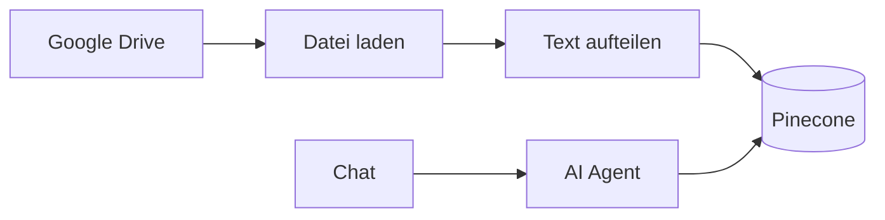
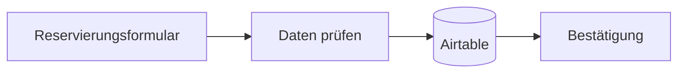

# Meine n8n-Projekte

Hier sind zwei kleine Workflows, die ich beim Lernen von n8n gebaut habe. Ich wollte ausprobieren, wie verschiedene Dienste miteinander verbunden werden können.

## RAG-Chatbot

Der Workflow lädt Dateien aus Google Drive und speichert die Inhalte in Pinecone. Danach kann ein einfacher Chatbot Fragen zu den Dokumenten beantworten.

Datei: `rag-chatbot.json`

## Hotel-Reservierung

Ein kleines Formular nimmt eine Reservierung an und speichert Name und Zimmerauswahl in Airtable.

Datei: `hotel-reservation.json`

## So kann man die Workflows ausprobieren

1. In n8n einen neuen Workflow öffnen.
2. Über **Import from File** die gewünschte JSON-Datei importieren.
3. Die eigenen Verbindungen zu Google Drive, Pinecone, Airtable oder dem verwendeten KI-Modell auswählen.
4. Die im Workflow markierten Ordner, Tabellen und Felder an die eigenen Daten anpassen.
5. Jeden Schritt einzeln testen und den Workflow erst danach aktivieren.

## Was ich dabei gelernt habe

- Nodes miteinander verbinden
- Formulardaten weitergeben
- externe Dienste in n8n einbinden
- Zugangsdaten getrennt vom Workflow halten

## Hinweis

Zugangsdaten und persönliche IDs habe ich entfernt. Nach dem Import müssen die eigenen Konten und Einstellungen neu verbunden werden. Beide Workflows sind Lernprojekte und können noch verbessert werden.
